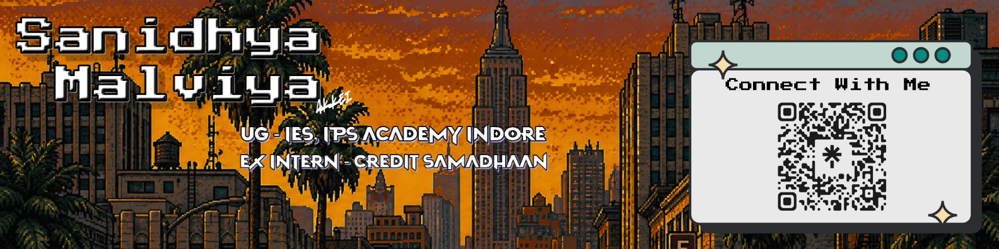

  

# I'm Sanidhya Malviya

🎓 **B.Tech CSE (3rd Year)** | IPS Academy, Indore  
📱 **Ex Intern - Credit Samadhaan**  
👥 Core Team Member @ GDGoC IPSA | Netryx Club  

---

## 🚀 About Me

I'm a Computer Science undergraduate with a strong interest in **AI agents , LLM orchestration** and **problem-solving**.  
Currently focused on building **real world AI agents** which aims in improving **productivity** and reducing **time required** and **humman efforts**.

I believe in **learning by building**, contributing to communities, and continuously upgrading my technical skills.

---
## Experience

### **SDE Intern** | **Credit Samadhaan**
*May 2026 - July 2026*

- Worked on development of a lifestyle app called **Raiseonic**.
- Created LLM orchestration for generating production grade credit improvement plan.
- Created a blog generating ai agent following the principles of AIO(Artificial Intelligence Optimization).
- Following Git-based workflows, debugging issues, and writing clean, maintainable code.
- Worked with opensource ai model(like Gemma4 Qwen3.5 , Lamma3 , Deepseek R1, KIMI , etc) and LLM inference tech(like Groq , LM flow , fireworks ai) for automating repetative tasks .
---

## 🌐 Connect With Me

  

  

  

  

# >_ Language :

# 💻 Tech Stack:

# ⚙️ Tools and Platforms

 

## 📌 Current Focus

- Optimized Orchestration
- RAG , MCP
- Deep agents
- Building and deploying production-ready AI products

---

## 📊 GitHub Stats

  
  

  

---

⭐ *Always open to collaboration, learning, and building impactful projects.*
